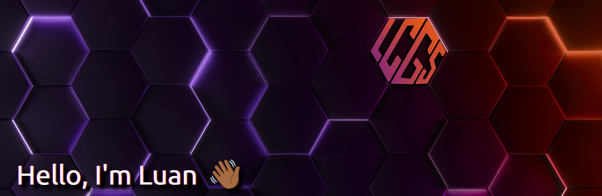

  

### 📝 About Me:

Hello, my name is Luan Carlos, I'm 23 years old.

- 😄 Pronouns: He/Him
- 🇧🇷 I am brazilian and currently studying to be an Automation Engineer.
- 🔭 I’m currently looking for a job.
- 🌱 Learning to automate tasks usings scripts in Bash, Lua and JS.

### GitHub Status

|  |  |
| :------------------------------------------------------------------------------------------------------------------: | :-----------------------------------------------------------------------------------------------------------------: |

### Languages and Frameworks

<!--
**luancgs/luancgs** is a ✨ _special_ ✨ repository because its `README.md` (this file) appears on your GitHub profile.

Here are some ideas to get you started:

- 🔭 I’m currently working on ...
- 🌱 I’m currently learning ...
- 👯 I’m looking to collaborate on ...
- 🤔 I’m looking for help with ...
- 💬 Ask me about ...
- 📫 How to reach me: ...
- 😄 Pronouns: ...
- ⚡ Fun fact: ...
  -->
